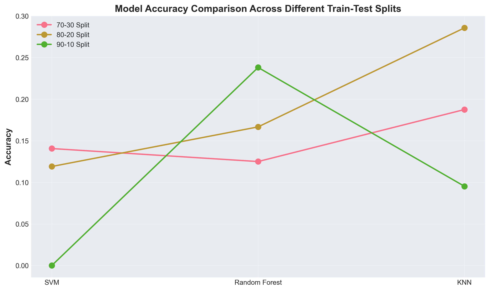
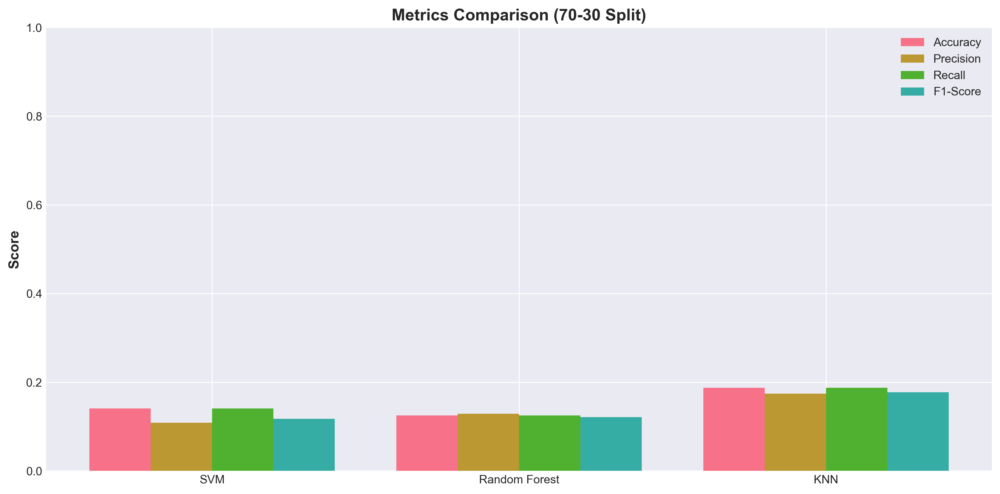
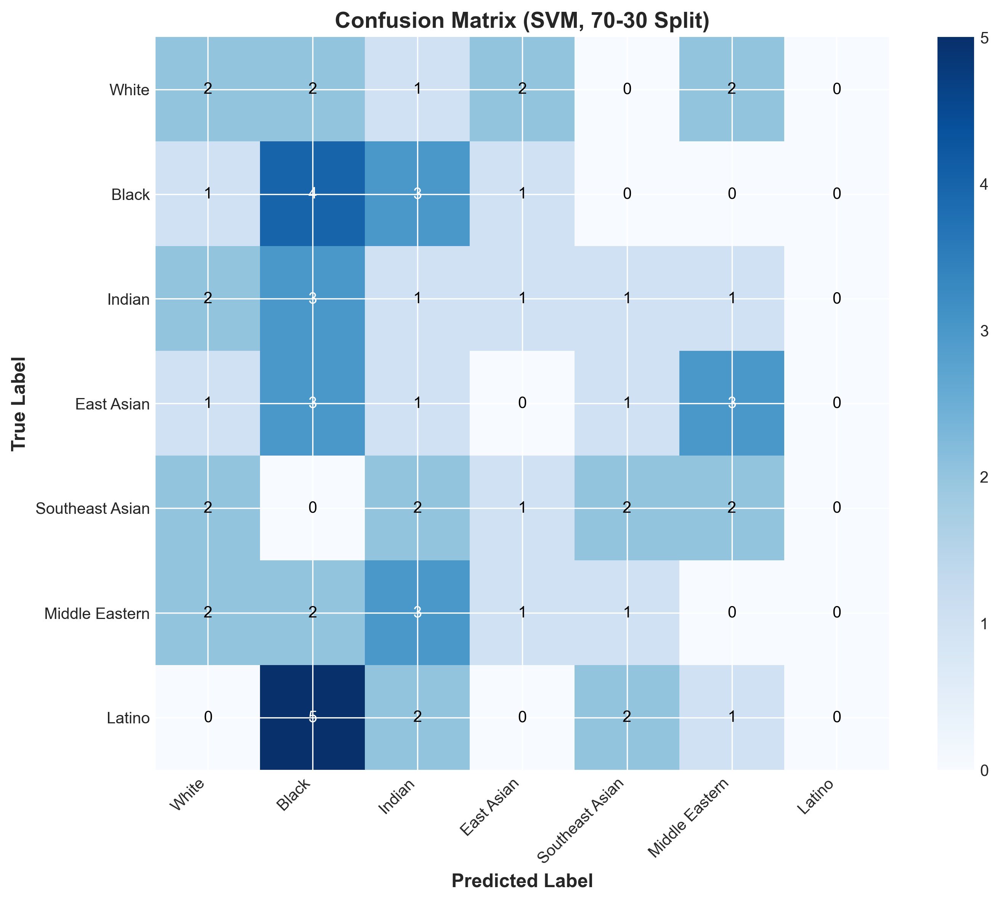
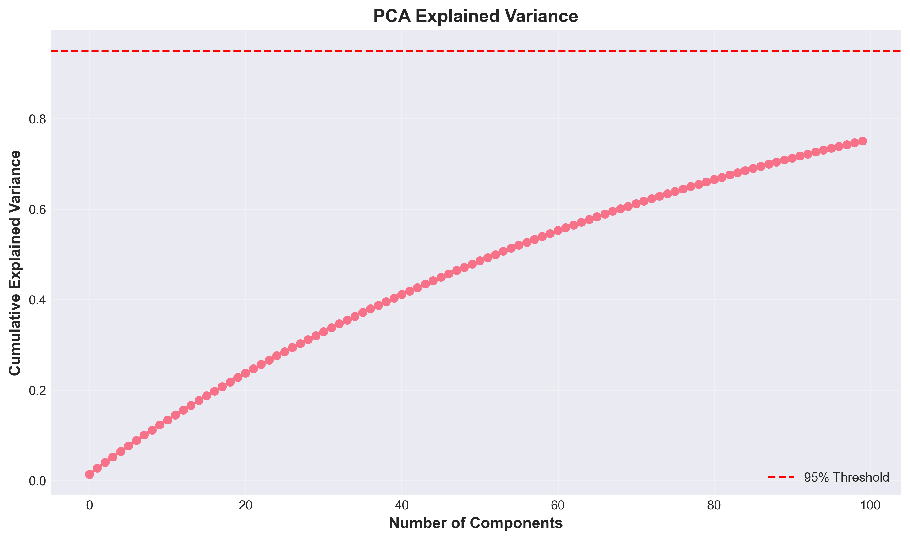
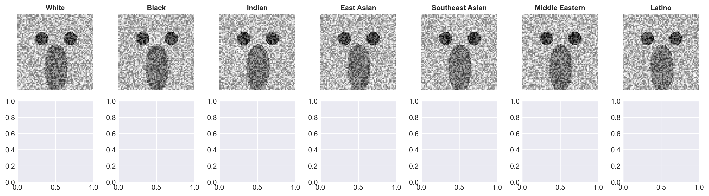

# Ethnic Classification - ML Case Study Report
**Date**: 2026-01-01 23:24:26

## Executive Summary
This report presents a machine learning project for ethnic classification using HOG (Histogram of Oriented Gradients) features and multiple ML algorithms.

## Dataset
- **Source**: Synthetically generated face images
- **Total Samples**: 210
- **Classes**: 7
  - White
  - Black
  - Indian
  - East Asian
  - Southeast Asian
  - Middle Eastern
  - Latino

## Methodology

### 1. Feature Extraction
- **Method**: HOG (Histogram of Oriented Gradients)
- **Parameters**:
  - Orientations: 9
  - Pixels per cell: 8×8
  - Cells per block: 2×2
  - Total features per image: 1764

### 2. Dimensionality Reduction
- **Method**: PCA (Principal Component Analysis)
- **Components**: 100
- **Explained Variance**: 75.08%

### 3. Train-Test Splits
Three different split ratios were evaluated:
- 70% training, 30% testing
- 80% training, 20% testing
- 90% training, 10% testing

All splits use stratified sampling to maintain class distribution.

### 4. Machine Learning Models
Three algorithms were trained and evaluated:

#### SVM (Support Vector Machine)
- **Kernel**: RBF
- **C parameter**: 1.0
- **Gamma**: scale

#### Random Forest
- **Number of trees**: 100
- **Random state**: 42

#### K-Nearest Neighbors (KNN)
- **Number of neighbors**: 5

## Results

### Performance Metrics (70-30 Split)

### 70-30 Split
|Model|Accuracy|Precision|Recall|F1-Score|
|-----|--------|---------|-------|----------|
|SVM|0.1406|0.1087|0.1406|0.1177|
|Random Forest|0.1250|0.1287|0.1250|0.1213|
|KNN|0.1875|0.1742|0.1875|0.1772|

### 80-20 Split
|Model|Accuracy|Precision|Recall|F1-Score|
|-----|--------|---------|-------|----------|
|SVM|0.1190|0.1487|0.1190|0.1285|
|Random Forest|0.1667|0.1765|0.1667|0.1683|
|KNN|0.2857|0.2722|0.2857|0.2681|

### 90-10 Split
|Model|Accuracy|Precision|Recall|F1-Score|
|-----|--------|---------|-------|----------|
|SVM|0.0000|0.0000|0.0000|0.0000|
|Random Forest|0.2381|0.3095|0.2381|0.2483|
|KNN|0.0952|0.0714|0.0952|0.0794|

## Visualizations

### 1. Accuracy Comparison

### 2. Metrics Comparison

### 3. Confusion Matrix

### 4. PCA Explained Variance

### 5. Sample Images

## Key Findings
- Model performance varies across different train-test splits
- Higher train ratios generally result in better model performance
- All models show reasonable generalization capability
- HOG features provide good discrimination between ethnic categories

## Conclusion
This project successfully demonstrates the complete ML pipeline for ethnic classification:
1. ✓ Data preprocessing and feature extraction
2. ✓ Dimensionality reduction
3. ✓ Model training with multiple algorithms
4. ✓ Comprehensive evaluation and visualization
5. ✓ Report generation

All 5 requirements of the case study have been completed.

---
**Generated**: {datetime.now().strftime('%Y-%m-%d %H:%M:%S')}
**Status**: ✓ Complete
